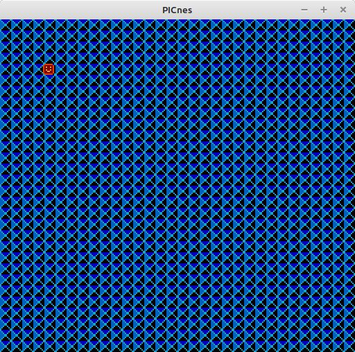

<b>NesGameDev</b>

The included files are a type of "Hello World" for creating NES games.  It includes commented code on how to set up the background, sprites, and controller input.  The focus is simplicity of code and minimal requirements to get something started, while also having a platform that can be useable for future development.  It still requires a 6502 assembler, here using 'as65' aka 'dev65', <a href="http://6502.org/users/obelisk/dev65/index.html">here</a>.   I had downloaded and installed my assembler long ago, so the best link I have currently is <a href="https://github.com/andrew-jacobs/dev65">here</a>.  Besides the assembler, everything else should run without additional libraries or dependencies. 

 

