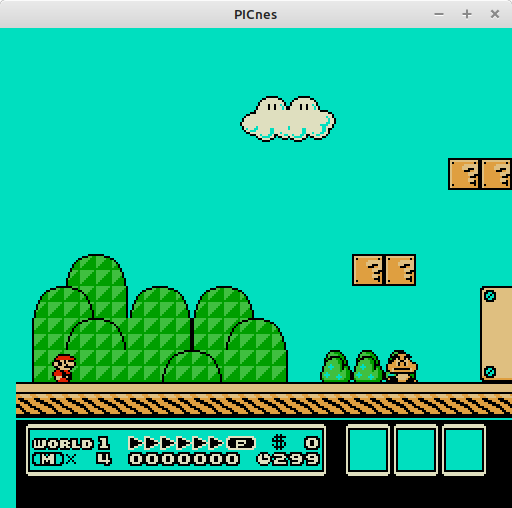
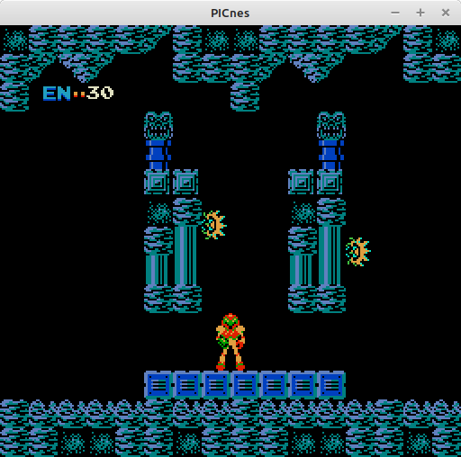
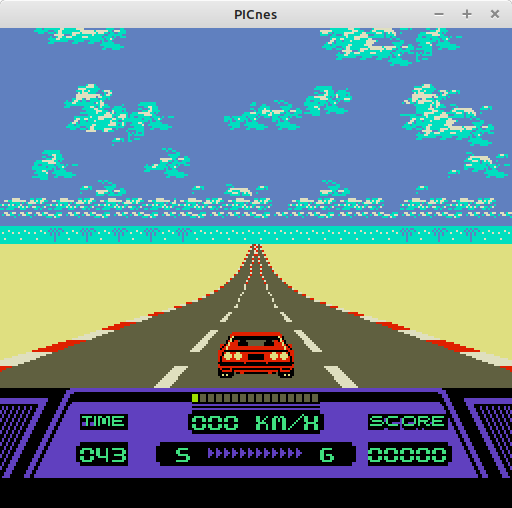
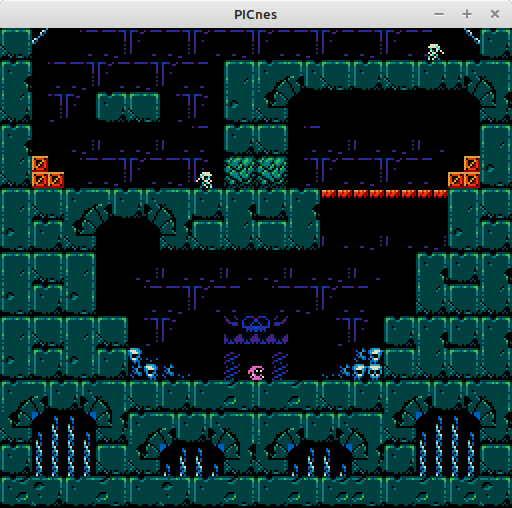
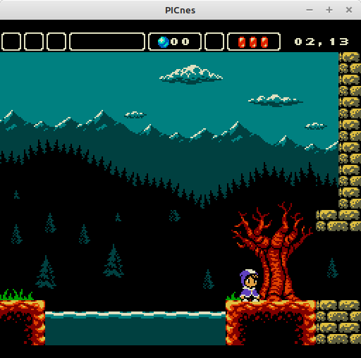

# PICnes
<b>A fast NES Emulator written in C specifically for microcontrollers.</b> 

Inspired by Mahyar Koshkouei's <a href="https://github.com/deltabeard/Peanut-GB">Peanut-GB (with MiniGB-APU)</a>, I designed my own NES emulator compariable to his Gameboy emulator.  This project is the result of a few months of very dedicated programming, then small updates and changes when necessary.  The goal of PICnes was to run on the PIC32MZ microcontroller at 260 MHz with only 512KB of RAM and 2MB of ROM. 

<b>Features:</b> 
- Everything is inside of a single C file.  Nothing complicated about it.  Easy to port! 
- Specific functions for video, audio, and buttons making it easy to change to your specific needs. 
- Uses OpenGL/GLFW and OpenAL for video, keyboard, and audio for an open platform to start from. 
- Works with most games, including mappers: NROM, UNROM, CNROM, ANROM, MMC1, and MMC3 (mostly implemented). 
- Very fast!  Runs games on a PIC32MZ microcontroller at 45 FPS with only a few exceptions. 
- Public domain, free for all to use! 

<b>Known Issues:</b> 
- Megaman 3, Megaman 4, and Ninja Gaiden 2 will not start unless the V-Sync Hack is turned on, but it can then be turned off later. 
- Super Mario Bros 3 sprite priority is wrong, the Sprite Priority Hack helps a little bit. 
- Audio quality from OpenAL is terrible, but it is at least proof-of-concept to port to other platforms. 

<b>Links:</b> 
- For the first version of this emulator, and large list of working ROMs, go here: <a href="https://github.com/stevenchadburrow/AcolyteHandPICd32/tree/main/NES">AcolyteHandPICd32/NES</a>. 
- For my last PIC32MZ microcontroller project that uses this emulator, go here: <a href="https://github.com/stevenchadburrow/AcolyteHandheld">AcolyteHandheld</a>. 
- For my Raspberry Pi Zero 2W project that uses this emulator, go here: <a href="https://github.com/stevenchadburrow/RPi02W-Emulators">RPi02W-Emulators</a>. 
- For the #1 guide to NES programming, go here: <a href="https://www.nesdev.org/wiki/Nesdev_Wiki">NESdev Wiki</a>. 

<b>Images:</b> 
<table>
<tr><td></td>
  <td></td></tr>
<tr><td></td>
  <td></td></tr>
<tr><td></td>
  <td></td></tr>
<tr><td></td>
  <td></td></tr>
</table>

